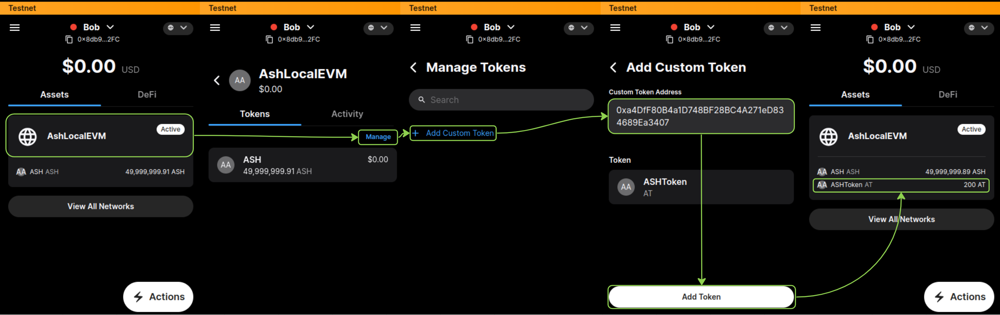

import Tabs from '@theme/Tabs';
import TabItem from '@theme/TabItem';

# Smart Contract Deployement

In this section, we will deploy a smart contract to launch the ASHToken ERC20 token on an EVM Subnet deployed using the [ash.avalanche](https://github.com/AshAvalanche/ansible-avalanche-collection) Ansible collection.

:::note
For this tutorial, we will use the [`local`](https://github.com/AshAvalanche/ansible-avalanche-getting-started/tree/main/inventories/local) inventory provided by the [Ansible Avalanche Getting Started](https://github.com/AshAvalanche/ansible-avalanche-getting-started) repository. See [Create a Local Test Network](./local-test-network) for details.

We should also have created a Subnet and a blockchain, see [Subnet Creation](/docs/toolkit/ansible-avalanche-collection/tutorials/subnet-creation) for details.
:::

## Requirements

- Foundry installed. (see [Install foundry](https://book.getfoundry.sh/getting-started/installation).)

## Configure the environement

To compile the contract, we need to clone two dependencies into the `ash_token/lib` folder.

```bash title="Command"
cd ash_token
git clone https://github.com/foundry-rs/forge-std lib/forge-std
git clone https://github.com/OpenZeppelin/openzeppelin-contracts.git lib/openzeppelin-contracts
```

## Deploy the contract

In order to deploy the ASH token we need to sign the transaction and to configure the RPC URL. To do so, we will use the private key of the pre-funded account (see [configure-the-subnet-transactions-wallet](https://ash.center/docs/toolkit/ansible-avalanche-collection/tutorials/subnet-creation#configure-the-subnet-transactions-wallet)).
:::tip
This key is CB58-encoded which is not handled by forge commands. See [show-information-about-the-wallet](https://ash.center/docs/toolkit/ash-cli/tutorials/wallet-funding#show-information-about-the-wallet) to retrieve the Hex-encoded version.
:::

We also need the rpc url (see [connect-to-the-subnet-and-start-issuing-transactions](https://ash.center/docs/toolkit/ansible-avalanche-collection/tutorials/subnet-creation#connect-to-the-subnet-and-start-issuing-transactions)) for each cmds.

```bash title="Command"
export RPC_URL=http://${VALIDATOR01_IP}:9650/ext/bc/${BLOCKCHAIN_ID}/rpc
export BOB_PRIVATE_KEY=0x56289e99c94b6912bfc12adc093c9b51124f0dc54ac7a766b2bc5ccf558d8027
```

Now, we can deploy our ERC20 with an initial supply of 200 tokens:

```bash title="Command"
forge create --rpc-url $RPC_URL --private-key $BOB_PRIVATE_KEY src/ASHToken.sol:ASHToken --constructor-args 200000000000000000000
```

```bash title="Output"
Compiler run successful!
 Deployer: 0x95AF400F4FDB27281bcc6Fc60Ad8aB5cD31dC35a
 Deployed to: 0x631a3621031d9483b2Ca0f34c3A6F0d0fEf17155
 Transaction hash: 0xfeb4b67875c1daaf92be3cf7ffbb01fdfdbffcf81e81d4c9fd329397f492af99
```

## Interact with the contract

### Using cast

Firstly we defind the followings variables for convegnence:
```bash title="command"
export BOB_ADDR=0x95AF400F4FDB27281bcc6Fc60Ad8aB5cD31dC35a
export CONTRACT_ADDRESS=0x631a3621031d9483b2Ca0f34c3A6F0d0fEf17155
```

As [forge](https://book.getfoundry.sh/reference/forge/), [cast](https://book.getfoundry.sh/reference/cast/) is a part of the [foundry](https://github.com/foundry-rs/foundry) suit which allow us to interact with the contract:
```bash title="command"
cast call $CONTRACT_ADDRESS "totalSupply()(uint256)" --rpc-url $RPC_URL
cast call $CONTRACT_ADDRESS "balanceOf(address)(uint256)" $BOB_ADDR --rpc-url $RPC_URL
```

### Using your wallet

:::tip
To be connected on the correct blockchain, please refer to  [connect-to-the-subnet-and-start-issuing-transactions](http://localhost:3000/docs/toolkit/ansible-avalanche-collection/tutorials/subnet-creation#connect-to-the-subnet-and-start-issuing-transactions) section.
:::

Like every EVM-based blockchains, we can register a new token in a wallet ([Core](https://core.app/) in our case) to interact with it. To do so, open the wallet, add a custom token and fill the contract address:

