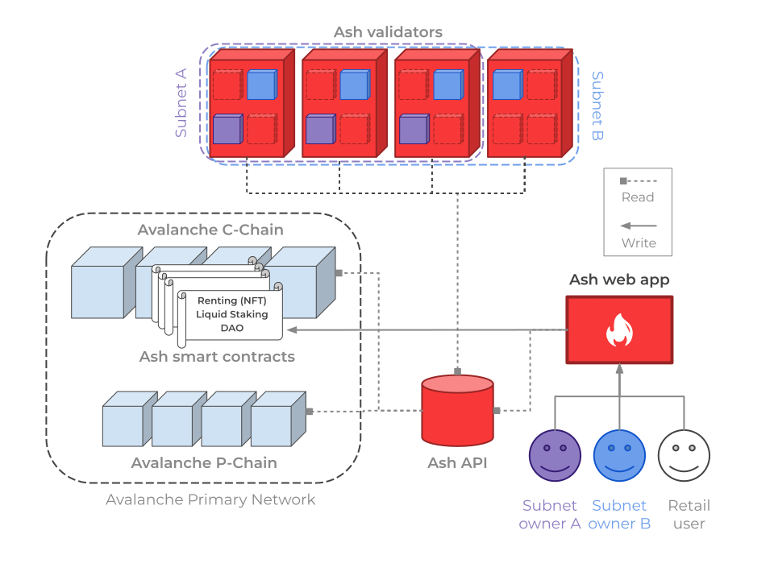
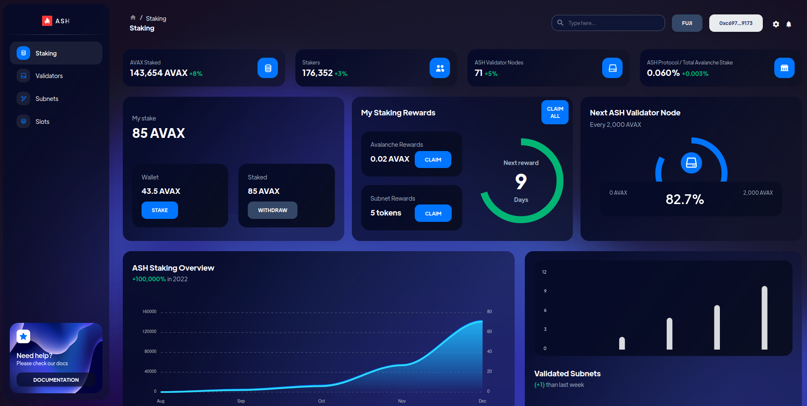
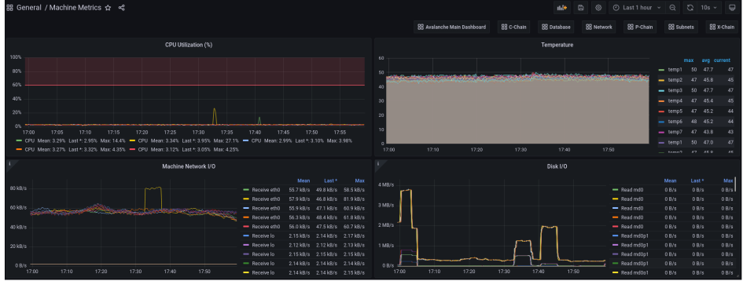

# Ash Whitepaper

## Abstract

_Ash is a project that makes Avalanche Subnets more accessible and decentralized._

_The Ash protocol operates validator nodes, hosts Avalanche Subnets, and gives retail users easy access to the Subnets ecosystem._

## Context

Avalanche allows any user to launch and operate its own blockchain network, with a customizable set of rules, through its **scaling solution called “Subnets”**.

Each Subnet is independent and can **scale infinitely** as it is not constrained by network resources and competition with other apps.

Use cases for Subnets range from **Web3 gaming** (Crabada, DeFi Kingdoms) to **institutions** (Deloitte).

We believe that Subnets currently have some **obstacles preventing wide adoption**. Ash aims at reducing those.

## Problematic

The **cost of entry** (monetary and technical) for an Avalanche project to operate its own Subnet is very high.

### Monetary entry cost

The Avalanche documentation states:

_For stability reasons, our recommendation is to have **at least 5 full validators** on your Subnet._

Running a validator node on the Avalanche Mainnet requires staking 2,000 AVAX. At $30 per AVAX, a Subnet owner needs to stake 10,000 AVAX at a total cost of $300,000 to run its blockchain on a 5-nodes Subnet.

**Note:** This calculation does not include the hosting price for the validator nodes’ servers on cloud or on-premise infrastructure.

### Technical entry cost

Deploying and maintaining a Subnet is **technically challenging** and requires time and skills that a team may not have. The Ash team experienced it first-hand at the Avalanche Summit Hackathon where most of the technical discussions with other teams were about node/Subnet operating issues.

### Subnet ecosystem accessibility

There is currently no option for an Avalanche user to get involved with Subnets without owning and operating a validator node.

## Goals

The Ash protocol aims at making Avalanche Subnets more **accessible and decentralized**.

Ash gives Avalanche projects access to a **robust and affordable infrastructure** to validate their Subnets. The protocol operates the validator nodes and developers can focus on the heart of their product.

Ash also allows **retail users** to get involved in the Avalanche **Subnets ecosystem** through **liquid staking**. Stakers help fund new Ash validator nodes and vote to choose which Subnets are validated by the protocol.

The Ash protocol relies on **third-party node operators** to make sure that Subnets are really decentralized.

## Ash Demographics

The Ash protocol targets 3 user groups:

- Subnet owners
- Retail users
- Node operators

### Ash for Subnet owners

In this section, we define a “**Subnet Owner**” as an institution, whether public or private, that needs a dedicated Avalanche Subnet. The Subnet hosts one or more blockchains, serving as a backend for the business logic.

The core value of Ash to Subnet owners is to propose **validator node renting**. Instead of running their validator nodes themselves, the Subnet owners will benefit from the expertise of the Ash technical team.

The validator's rent can be paid to Ash with **AVAX, native tokens**, or a **combination** of both (on a monthly basis). The Ash protocol guarantees that the Subnets are validated by a robust, up-to-date set of Avalanche validators.

Subnet owners are freed from the burden of running their own infrastructure and can instead **focus on building projects**.

### Ash for retail users

Ash will feature a **community pool** in which retail users can liquid-stake their AVAX and Subnet native tokens. This pool will be used to **crowdfund new validator nodes** for the Ash protocol which will in turn increase the number of Subnets that can be validated.

The Ash pool features a triple rewards system for stakers:

- AVAX
- ASH
- Native tokens from the validated Subnets

_AVAX_

Stakers receive AVAX from **node validation rewards** like they would by delegating their AVAX but in a **much more flexible way**.

_ASH_

Stakers receive **ASH tokens** emitted by the Ash protocol proportionally to the amount of AVAX they stake in the community pool.

The ASH token will be used by the stakers to vote in the **DAO**. Votes will include which Subnets get to be validated by the Ash protocol and which node operators will get AVAX delegation to spin up new validators.

**Note:** See Tokenomics for more details on the ASH token.

_Native subnet tokens_

Subnet owners can **incentivize the validation** of their Subnets by providing native tokens to the Ash protocol (leveraging features of the Banff upgrade). These tokens will be **redistributed to the community** pool stakers.

### Ash for node operators

Node operators can apply to **operate Ash validator nodes**. If a node operator is **elected by the DAO**, the protocol will stake some AVAX and Subnet native tokens from the community pool on the operator’s nodes. Revenues generated from these new nodes will be **redistributed to the Ash community**, and node operators will be rewarded.

This key feature of the Ash protocol provides **true decentralization** of Subnet validation.

Node operators can also benefit from the Ash team’s DevOps expertise by leveraging the Ansible Avalanche Collection.

## Technical Details

### Overall Architecture

The following schema represents the target protocol architecture. All features will not be available in the first release (see Protocol evolution towards more decentralization).

<figure>

<figcaption style={{textAlign: 'center'}}>Fig.1 - Ash protocol architecture</figcaption>
</figure>

_Ash validators_

Each Ash validator node offers “**Subnet slots**” for renting. The number of slots available on a node is determined by its hardware characteristics. A rented slot corresponds to a blockchain VM running on the node.

The Ash team will conduct large-scale benchmarking of blockchain VMs performances to determine the resources comprised within a Subnet slot.
Validator nodes are operated by the **Ash team** and **third-party node operators** (elected by the DAO).

_Ash contracts_

**All transactions** related to Subnet slots renting, liquid staking, and DAO votes are **tracked on-chain**.
The Ash protocol leverages the popularity and robustness of the Avalanche C-chain to host its smart contracts. It relies on _trusted smart contract standards_ for its different building blocks:

- Subnet slots rentals are represented by ERC-721 NFTs
- The liquid staking contracts will take inspiration from industry standards like Lido
- The DAO will follow an established framework (most likely Aragon)

_Ash API_

The Ash API tracks all on-chain activity on both Avalanche C-chain (renting contracts) and P-chain (Subnets/blockchains operations). It exposes the **current state of the protocol**:

- Validator nodes and Subnets status
- Subnet slots rentals
- Liquid staking pool size and DAO votes

The Ash web app and Ash validator nodes rely on the API.

<figure>

<figcaption style={{textAlign: 'center'}}>Fig.2 - Web app PoC staking dashboard</figcaption>
</figure>

The Ash web app is the **main entry point** to interact with the protocol.

Subnet owners use it to create, configure, validate and monitor their Subnets/blockchains. Retail users use it to liquid-stake AVAX and Subnet native tokens, participate in DAO votes, and claim rewards. Node operators use it to manage their validator nodes.

### Ansible Avalanche Collection

Ava Labs provides tools to bring up validator nodes and create/manage subnets (Avalanche Network Runner, Avalanche Cli, Avalanche Ops). Yet, at the time of writing, none of those are production-ready (according to their documentation).

Relying on years of experience in DevOps best practices, the Ash team developed the Ansible Avalanche Collection. Using Ansible, the **industry standard for IT automation**, the collection allows developers to **deploy and configure** nodes, Subnets, and blockchains to their own infrastructure, whether on bare-metal machines or virtual machine instances from **any cloud provider**.

There are multiple perks to using the Ansible Avalanche Collection, including:

- **Reduce errors** related to manual configurations
- **Scale** to hundreds of nodes seamlessly
- **Update or rollback** the AvalancheGo version in a transparent fashion
- The benefit of a production-ready configuration of AvalancheGo following the Filesystem Hierarchy Standard

The Ansible Avalanche Collection is open-source and available on **GitHub** under the **BSD-3 license**. The Ash team is committed to open-source all the tools that will benefit Avalanche users and developers.

The Avalanche Ansible Collection is part of our solution to **reduce the technical cost** related to deploying validator nodes, Subnets, and blockchains.

### Extra services

Ash provides additional tools to **empower Subnet owners** with a ready-to-use Subnet experience, including monitoring and other services.

_Node monitoring_

<figure>

<figcaption style={{textAlign: 'center'}}>Fig.3 - Node monitoring with Grafana</figcaption>
</figure>

All the validating nodes of the Ash protocols are **monitored** using Grafana and Prometheus. Subnet owners have access to comprehensive dashboards which include all the metrics they need to keep track of the nodes validating their Subnets.

Ash can also provide additional blockchain-related metrics to Subnet owners.

_DNS / Load Balancers_

Ash will provide a unique DNS entry for Subnet owners (e.g.: _mysubnet.ash.center_). This entry will be served by multiple validators in a Load Balancing fashion. Subnet owners can focus on the heart of their project while Ash takes care of the accessibility of the Subnet.

### Protocol Evolution Towards More Decentralization

Building a truly **decentralized protocol** cannot be done overnight and we believe that it is more important to start with a rather centralized but robust protocol than to rush onto a broken “decentralized” protocol.

The first Ash release will focus on building a **reliable software layer** for validator node operating and offering the **best possible experience** to Subnet owners.

The following features will be available in the subsequent releases of the protocol.

_Liquid Staking (v2)_

Users will stake AVAX and Subnet native tokens into the Ash community pool to be eligible for rewards: AVAX staking rewards, Subnets rewards, and ASH tokens.
Like any liquid staking protocol, users will receive tokens (ashAVAX, ashTOKENX, ashTOKENY) that represent their stake and can be freely transferred, traded, or used in other DeFi protocols.

_DAO (v2)_

The Ash DAO (Decentralized Autonomous Organization) will give ASH token owners the power to choose what Subnets are validated by the Ash protocol and how many nodes are validating each Subnet.

_Third-party node operators (v3)_

The Ash protocol will fund third-party node operators to spin-up new validator nodes. The Ash node operators will be elected by the DAO, following a model that will take strong inspiration from the Lido protocol on Ethereum.

## Tokenomics

### ashAVAX Token

ashAVAX is an ERC20 token that represents AVAX staked within the Ash protocol. Unlike staked AVAX, it is liquid, meaning that it can be transferred, traded, or used in other DeFi applications.

The total supply of ashAVAX reflects the amount of AVAX deposited into the protocol combined with staking rewards.

ashAVAX tokens are minted upon AVAX deposited in the community pool at a 1:1 ratio.

When AVAX are withdrawn from the community pool, ashAVAX are burned following the same 1:1 ratio.

### ASH Token

ASH is an ERC-20 governance token that allows users to vote for the Subnets they want the Ash protocol to validate.

All users that are liquid-staking AVAX in the Ash community pool will receive ASH rewards.

ASH can be used to vote in the DAO for:

- Choosing the subnets validated by the Ash validator nodes and the number of validator nodes allocated to each subnet
- Electing the node operators that will spin up new validators using AVAX from the community pool

A public sale will occur after the launch of the protocol.

### Glossary

**Subnet:** An independent network with a customizable set of rules running on Avalanche. A Subnet hosts one or more blockchains, serving as a backend for the business logic.

**Subnet Owner:** An institution, whether public or private, that needs a dedicated Avalanche Subnet.

**Validator node:** A server, whether a virtual machine or a physical host, running the AvalancheGo program. A validator can validate one or multiple subnets.

**DAO:** Decentralized Autonomous Organization. There is not a single entity controlling the organization, individuals from the community have their own decision-making power regarding their voting power.

**Ansible:** The industry standard for IT automation, used to power the Ash protocol (see ansible-avalanche-collection).
