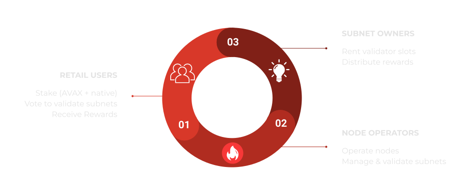
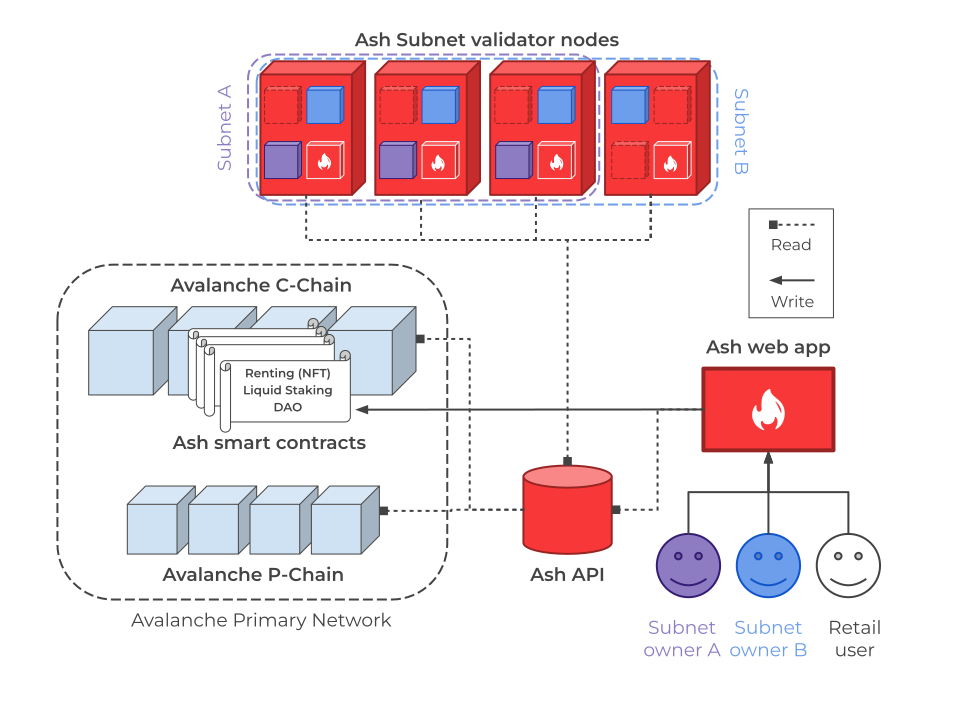
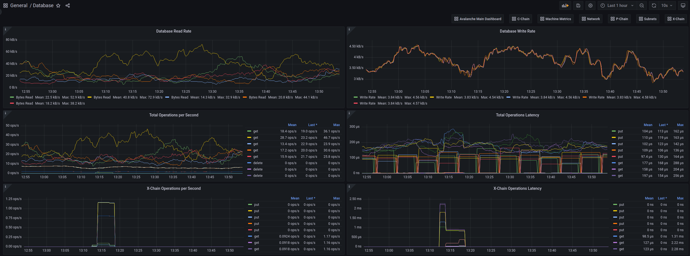

# Ash Whitepaper

| Version | Date       | Authors                                                                                                                   | Description    |
| ------- | ---------- | ------------------------------------------------------------------------------------------------------------------------- | -------------- |
| 1.0     | 25/02/2023 | Gauthier Leonard - gauthier@e36knots.com Antoine Laborde - antoine@e36knots.com Léo Schoukroun - leo@e36knots.com | Public release |

## Abstract

_Ash is a **decentralized Validator as a Service (VaaS) protocol** that makes **Avalanche Subnets [1](#glossary)** more accessible and decentralized._  
_The Ash protocol operates Avalanche nodes [3](#glossary), validates Avalanche Subnets, and gives retail users easy access to the Subnets ecosystem._

## Context

[Avalanche](https://avax.network) allows any user to launch and operate its own blockchain network, with a customizable set of rules, through its **scaling solution called “Subnets” [1](#glossary)**.

Each Subnet is independent and can **scale infinitely** as it is not constrained by network resources and competition with other apps.

Use cases for Subnets range from **Web3 gaming** ([Crabada](https://medium.com/@PlayCrabada/introducing-crabadas-subnet-on-the-avalanche-network-18cb310ddb8c), [DeFi Kingdoms](https://medium.com/defi-kingdoms-official/defi-kingdoms-announces-defi-kingdoms-blockchain-2d51333b1e4e)) to **institutions** ([Deloitte](https://medium.com/avalancheavax/deloitte-leverages-avalanche-to-improve-recoveries-from-natural-disasters-and-public-health-4fa3fd3644bf), [Intain](https://medium.com/avalancheavax/intain-launches-avalanche-subnet-to-usher-in-new-era-for-multi-trillion-dollar-securitized-877c7cc1031f)).

We believe that Subnets currently have some **obstacles preventing wide adoption**. Ash aims at reducing those.

## Problematic

The **entry costs** (financial and technical) to the Subnet ecosystem are very high **for all the participants**: Subnet owners [2](#glossary), retail users that want to get involved, and node operators.

### Financial entry cost

Running a validator node [4](#glossary) on the Avalanche Mainnet requires staking 2,000 AVAX.

#### For Subnet owners

> For stability reasons our recommendation is to have **at least** 5 full validators on your Subnet. - [Avalanche documentation](https://docs.avax.network/subnets/deploying-subnets-on-prod#number-of-validators)

At $30 per AVAX, a Subnet owner needs to stake 10,000 AVAX, for a total cost $300,000, to be able run blockchains on a 5-nodes Subnet.

**Note:** This calculation does not include the hosting price for the validator nodes’ [4](#glossary) servers on cloud or on-premise infrastructure.

#### For node operators

In addition to the 2,000 AVAX required by the Mainnet, Subnet owners can require **staking extra tokens** to participate in their Subnets' validation. That financially limits potential node operators to **companies and a few privileged individuals**.

### Technical entry cost

#### For Subnet owners and node operators

Deploying and maintaining a Subnet and Avalanche nodes [3](#glossary) is **technically challenging** and requires time and skills that a team may not have. The Ash team experienced it first-hand at the Avalanche Summit Hackathon where most of the technical discussions with other teams were about node/Subnet operating issues.

### Subnet ecosystem accessibility

#### For retail users

To participate in Subnets validation, **a user has to operate Avalanche node(s) [3](#glossary)**, therefore becoming a node operator and facing the same challenges.

## Goals

The Ash protocol aims at making Avalanche Subnets more **accessible and decentralized** by providing a decentralized VaaS [5](#glossary) for Avalanche.

Ash gives Avalanche projects affordable access to a **robust decentralized infrastructure** to validate their Subnets. The protocol operates the validator nodes [4](#glossary), and developers can focus on the heart of their product.

Ash also allows **retail users** to get involved in the Avalanche **Subnets ecosystem** through **liquid staking [6](#glossary)**. Stakers crowdfund new Ash validator nodes and vote to **allocate the protocol validation power** between Subnets.

The Ash protocol relies on **third-party node operators** to ensure the Subnets' decentralization.

## Ash Demographics

The Ash protocol targets 3 user groups:

- Subnet owners
- Retail users
- Node operators

### Ash for Subnet owners

Ash offers 2 validation services to Subnet owners:

- Validation renting
- Voted validation by the protocol

#### Validation renting

Subnet owners can **rent validation** from Ash nodes for a **fraction of the price** needed to bootstrap a validator.

Instead of operating validator nodes [4](#glossary) themselves, Subnet owners benefit from the expertise of the Ash team.

The rent is paid monthly in AVAX, native tokens, or a combination of both. The protocol guarantees that Subnets are validated by a **robust, up-to-date set of nodes**.

Subnet owners are freed from the burden of running their own infrastructure and can instead focus on building their projects' core.

#### Voted validation

Liquid stakers [6](#glossary) can participate in the protocol's governance. The main governance component is **the allocation of the protocol's validating power** between Subnets.

Node operator **rewards are redistributed to liquid-stakers**. With attractive incentives, a Subnet will **naturally get more decentralized** because it will appeal to more users.

### Ash for retail users

Ash will feature a **community pool** in which retail users can liquid-stake [6](#glossary) their AVAX and Subnet native tokens. This pool is used to **crowdfund new validator nodes [4](#glossary)** for the Ash protocol which will in turn increase the number of Subnets that can be validated.

The Ash pool features three type of rewards for stakers:

- AVAX
- ASH
- Native tokens from the validated Subnets

#### AVAX

Stakers receive AVAX from **node validation rewards** as they would by delegating their AVAX, but in a **much more flexible way**.

#### ASH

Stakers receive **ASH tokens** emitted by the Ash protocol proportionally to the amount of AVAX they stake in the community pool.

The ASH token will be used by the stakers to vote in the **Ash DAO [7](#glossary)**. Votes will determine which Subnets are validated by the Ash protocol and which node operators get AVAX delegation to spin up new validator nodes.

**Note:** See [Tokenomics](#tokenomics) for more details on the ASH token.

#### Native Subnets tokens

Subnet owners can **incentivize the validation** of their Subnets by providing native tokens to the Ash protocol (leveraging features of the Banff upgrade). These tokens are **redistributed to the community** pool stakers.

### Ash for node operators

Node operators can **apply to operate Ash nodes** and **validate Subnets** for the protocol.

If a node operator is elected by the DAO [7](#glossary), its nodes will be allowed to **join the [Ash Subnet](#ash-subnet)**.

AVAX and Subnet native tokens **from the community pool** are staked on Ash nodes. The revenues generated are redistributed to the Ash community, and **node operators are rewarded**.

This key feature of the protocol provides **true decentralization** of Subnet validation.

Node operators can also benefit from the Ash team’s DevOps expertise by leveraging open-source tools provided by the Ash team.

## Technical Details

### Overall Architecture

The following schema represents the target protocol architecture. All features will not be available in the first release (see [Protocol evolution towards decentralization](#protocol-evolution-towards-decentralization)).

<figure>

<figcaption style={{textAlign: 'center'}}>Fig.1 - Ash protocol architecture</figcaption>
</figure>

#### Ash nodes

Each Ash validator node [4](#glossary) offers “**Subnet slots**” for renting. The number of slots available on a node is determined by its hardware characteristics. A rented slot corresponds to a blockchain VM [8](#glossary) running on the node.

The Ash team will conduct large-scale benchmarking of blockchain VMs performances to determine the resources comprised within a Subnet slot.

Validator nodes are operated by the **Ash team** and **third-party node operators** (elected by the DAO [7](#glossary)).

#### Ash contracts

**All transactions** related to Subnet slots renting, liquid staking [6](#glossary), and DAO votes are **tracked on-chain**.
The Ash protocol leverages the popularity and robustness of the Avalanche C-Chain [9](#glossary) to host its smart contracts. It relies on **trusted smart contract standards** for its different building blocks:

- Subnet slots rentals are represented by ERC-721 NFTs
- The liquid staking contracts will take inspiration from industry standards like [Lido](https://lido.fi)
- The DAO will follow an established framework (most likely [Aragon](https://aragon.org/))

#### Ash API

The Ash API tracks all on-chain activity on both Avalanche C-Chain (renting contracts) and P-Chain [10](#glossary) (Subnets/blockchains operations). It exposes the **current state of the protocol**:

- Validator nodes and Subnets status
- Subnet slots rentals
- Liquid staking pool size and DAO [7](#glossary) votes

The API will rely on **secured open-source software** that can generate ZK proofs of the data being served (most likely [Apibara](https://www.apibara.com/)). The Ash web app and Ash validator nodes rely on the API.

#### Ash web app

<figure>

<figcaption style={{textAlign: 'center'}}>Fig.2 - Web app PoC staking dashboard</figcaption>
</figure>

The Ash web app is the **main entry point** to interact with the protocol.

Subnet owners use it to create, configure, validate, and monitor their Subnets/blockchains. Retail users use it to liquid-stake AVAX and Subnet native tokens, participate in DAO votes, and claim rewards. Node operators use it to manage their validator nodes.

#### Ash Subnet

The Ash Subnet will serve as a **back-bone for the protocol**, ensuring Ash nodes' resources monitoring, subnet slots distribution, etc.

### Ansible Avalanche Collection

Ava Labs provides tools to bring up validator nodes [4](#glossary) and create/manage Subnets ([Avalanche Network Runner](https://github.com/ava-labs/avalanche-network-runner), [Avalanche CLI](https://github.com/ava-labs/avalanche-cli), [Avalanche Ops](https://github.com/ava-labs/avalanche-ops)). Yet, at the time of writing, none of those are production-ready (according to their documentation).

Relying on years of experience in DevOps best practices, the Ash team developed the [Ansible Avalanche Collection](https://github.com/AshAvalanche/ansible-avalanche-collection). Using [Ansible](https://ansible.com), the **industry standard for IT automation**, the collection allows developers to **deploy and configure** nodes, Subnets, and blockchains to their own infrastructure, whether on bare-metal machines or virtual machine instances from **any cloud provider**.

There are multiple perks to using the Ansible Avalanche Collection, including:

- **Reduce errors** related to manual configurations
- **Scale** to hundreds of nodes seamlessly
- **Update or rollback** the AvalancheGo version in a transparent fashion
- The benefit of a production-ready configuration of AvalancheGo following the Filesystem Hierarchy Standard

The Ansible Avalanche Collection is open-source and available on **GitHub** under the **BSD-3 license**. The Ash team is committed to open-source all the tools that will benefit Avalanche users and developers.

The Avalanche Ansible Collection is part of our solution to **reduce the technical cost** related to deploying validator nodes [4](#glossary), Subnets, and blockchains.

### Extra services

Ash provides additional tools to **empower Subnet owners** with a ready-to-use Subnet experience, including monitoring and other services.

#### Node monitoring

<figure>

<figcaption style={{textAlign: 'center'}}>Fig.3 - Node monitoring with Grafana</figcaption>
</figure>

All the validating nodes of the Ash protocols are **monitored** using Grafana and Prometheus. Subnet owners have access to comprehensive dashboards with all the metrics they need to keep track of the nodes validating their Subnets.

Ash can also provide additional blockchain-related metrics to Subnet owners.

#### DNS / Load Balancers

Ash will provide a unique DNS entry for Subnet owners (e.g.: _mysubnet.ash.center_). This entry will be served by multiple validator nodes in a Load Balancing fashion. Subnet owners can focus on the heart of their project while Ash takes care of the accessibility of the Subnet.

### Protocol Evolution Towards Decentralization

Building a truly **decentralized protocol** cannot be done overnight and we believe that it is more important to start with a rather centralized but robust protocol than to rush onto a broken “decentralized” protocol.

The first Ash release will focus on building a **reliable software layer** for validator node [4](#glossary) operating and offering the **best possible experience** to Subnet owners.

The following features will be available in the subsequent releases of the protocol.

#### Liquid Staking (V2)

Users will stake AVAX and Subnet native tokens into the Ash community pool to be eligible for rewards: AVAX staking rewards, Subnets rewards, and ASH tokens.
Like any liquid staking [6](#glossary) protocol, users will receive tokens (ashAVAX, ashTOKENX, ashTOKENY) that represent their stake and can be freely transferred, traded, or used in other DeFi protocols.

#### DAO (V2)

The Ash DAO [7](#glossary) (Decentralized Autonomous Organization) will give ASH token owners the power to choose what Subnets are validated by the Ash protocol and how many nodes are validating each Subnet.

#### Third-party node operators (V3)

The Ash protocol will fund third-party node operators to spin-up new validator nodes. The Ash node operators will be elected by the DAO, following a model that will take strong inspiration from the Lido protocol on Ethereum.

## Tokenomics

### ashAVAX Token

ashAVAX is an ERC20 token that represents AVAX staked within the Ash protocol. Unlike staked AVAX, it is liquid, meaning that it can be transferred, traded, or used in other DeFi applications.

The total supply of ashAVAX reflects the amount of AVAX deposited into the protocol combined with staking rewards.

ashAVAX tokens are minted upon AVAX deposited in the community pool at a 1:1 ratio.

When AVAX are withdrawn from the community pool, ashAVAX are burned following the same 1:1 ratio.

### ASH Token

ASH is an ERC-20 governance token that allows users to vote for the Subnets they want the Ash protocol to validate.

All users that are liquid-staking [6](#glossary) AVAX in the Ash community pool will receive ASH rewards.

ASH can be used to vote in the DAO for:

- Choosing the Subnets validated by the Ash validator nodes [4](#glossary) and the number of nodes [3](#glossary) allocated to each Subnet
- Electing the node operators that will spin up new validator nodes using AVAX from the community pool

A public sale will occur after the launch of the protocol.

### Glossary

1. **Subnet:** An independent network with a customizable set of rules running on Avalanche. A Subnet hosts one or more blockchains, serving as a backend for the business logic. See [Subnets Overview](https://docs.avax.network/subnets).
2. **Subnet owner:** An organization, whether public or private, that uses a dedicated Avalanche Subnet. The Subnet hosts one or more blockchains, serving as a backend for the business logic.
3. **Avalanche node:** A server, whether a virtual machine or a physical host, running the AvalancheGo program.
4. **Validator node:** An Avalanche node validates one or multiple Subnets. A minimum amount of staked tokens is required for a node to become validator of a Subnet.
5. **VaaS (Validator as a Service):** A product that offers to operate blockchain validator nodes on behalf of users, while they keep the ownership of their assets.
6. **Liquid Staking:** Liquid staking protocols allow users to get staking rewards without locking tokens or maintaining staking infrastructure. Users of these protocols can deposit staking tokens and receive tradable liquid tokens in return. (from [Lido FAQ](https://lido.fi/faq))
7. **DAO:** Decentralized Autonomous Organization. There is not a single entity controlling the organization, individuals from the community have their own decision-making power regarding their voting power.
8. **VM (Virtual Machine):** A Virtual Machine (VM) defines the application-level logic of a blockchain. In technical terms, it specifies the blockchain’s state, state transition function, transactions, and the API through which users can interact with the blockchain. (from [Avalanche Subnets docs](https://docs.avax.network/subnets#virtual-machines))
9. **Avalanche C-Chain:** The C-Chain is an implementation of the Ethereum Virtual Machine (EVM) that is part of Avalanche Primary Network. (from [Avalanche docs](https://docs.avax.network/overview/getting-started/avalanche-platform#contract-chain-c-chain))
10. **Avalanche P-Chain:** The P-Chain is responsible for all validator and Subnet-level operations. The P-Chain API supports the creation of new blockchains and Subnets, the addition of validators to Subnets, staking operations, and other platform-level operations. (from [Avalanche docs](https://docs.avax.network/overview/getting-started/avalanche-platform#platform-chain-p-chain))
